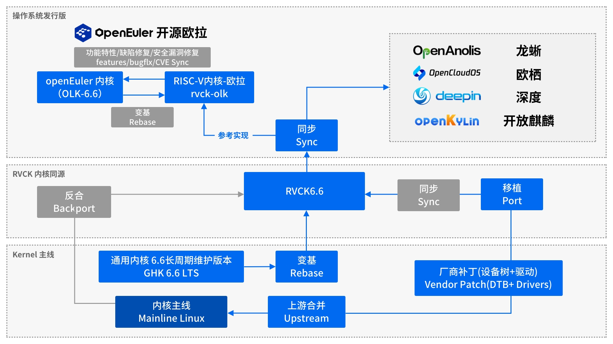

# RVCK ( RISC-V Common Kernel ) 

RISC-V 内核同源项目 

## 简介
RVCK 计划全面支持国产操作系统 RISC-V 版本研发，致力于构建统一的内核能力底座，为不同芯片平台提供可复用、可扩展的基础软件支持体系。

2024 年 7 月以来，中国科学院软件研究所（简称软件所）智能软件研究中心联合阿里巴巴达摩院、中兴通讯、进迭时空、算能、超睿科技等产业伙伴，以及开源欧拉、
开源龙蜥、开云、开放麒麟、深度等国产操作系统社区协同推进 RVCK 相关工作，围绕 RISC-V 服务器基础能力完善、统一内核体系建设及多硬件平台适配持续开展工作
。

### 已支持的硬件平台

| 厂商          |  SoC/开发板   |
| ------------- | ------------- |
| 阿里巴巴达摩院|   TH1520      |
| 算能          | SG2042/SG2044 |
| 超睿科技      | DP1000        |
| 进迭时空      | K1/K3         |

## 贡献过程

  
  [贡献手册](https://github.com/RVCK-Project/rvck/wiki)
  
  扫描微信二维码联系中科院软件所 王经纬:
<!-- 微信二维码部分 -->

  

