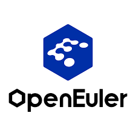

# RVCK ( RISC-V Common Kernel ) 

RISC-V 内核同源项目 

## 简介

RVCK 内核同源项目（也称 RVCK）是 kernel.org 以及 openEuler 等 linux 内核分支的下游，旨在为目前基于不同硬件平台的 RISC-V 开发生态提供一个统一的内核平台，维护公共开发演进需求，减少维护复杂度并增强软硬件上下游生态协同能力。

由于现有厂商内核版本与 kernel 6.6 较为接近，并且实现统一适配的技术难度较低。RVCK 目前的主要开发基座基于 Kernel6.6 版本，从 ServerPlatform 到内核 6.6 中间存在大量的移植工作，以及相应的测试与优化工作由 RVCK 项目负责。

RVCK 项目目前已经与 openEuler Kernel SIG 建立合作，所有经过验证的开发结果都会同步合入 openEuler OLK 项目。

### 已经合并的平台

| 厂商     | SOC    | 开发板         |
| -------- | ------ | -------------- |
| 算能     | SG2042 | Milk-V Pioneer |
| 平头哥   | TH1520 | LicheePi 4A    |
| 进迭时空 | K1     | Key Stone K1   |

## 贡献过程

虚线框内为rvck-olk项目的范畴，左边是厂商的代码，右边对接openEuler主线内核仓库。大致贡献过程是：

* 厂商首先整理代码，主要是通过checkpatch.pl测试和剔除商业代码；
* 新建一个issue;
* 发起pull requests并关联issue；
* 补丁通过oervci自动化测试；
* 人工审核代码是否符合rvck规范并确保代码质量；
* 最后合并进rvck-olk仓库的OLK-6.6分支；
* 稳定后我们会release至src发版仓库，该仓库为openEuler OS打包仓库；
* 我们会安排专业的工程师将合并的的补丁集提交到openEuler主线内核OLK-6.6分支。
  
  ## 如何开始
  
  [贡献手册](https://github.com/RVCK-Project/rvck-olk/wiki)
  
  扫描微信二维码联系中科院软件所 王经纬:

<table>
  <tr align="center">
    <td colspan="2" style="text-align: center;"></td>
  </tr>
</table>

## 合作单位

<table>
  <tr>
    <td style="text-align: center;"></td>
    <td style="text-align: center;"></td>
    <td style="text-align: center;"></td>
  </tr>
  <tr align="center">
    <td colspan="3" style="text-align: center;"></td>
  </tr>
  <tr align="center">
    <td colspan="3" style="text-align: center;"></td>
  </tr>
</table>

